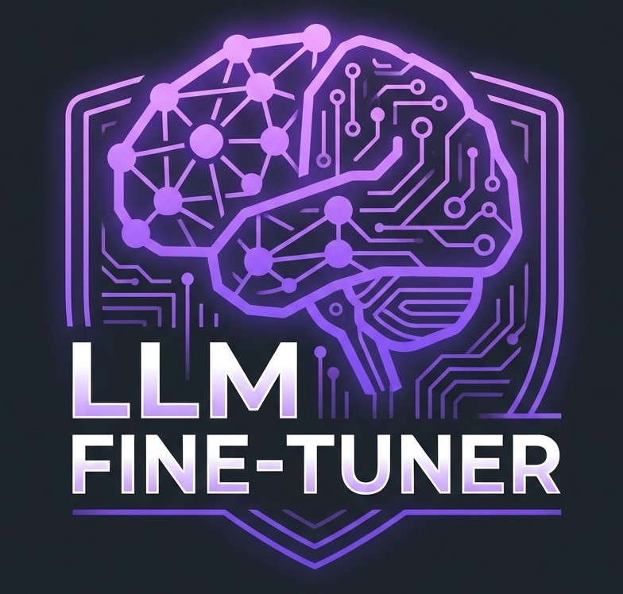
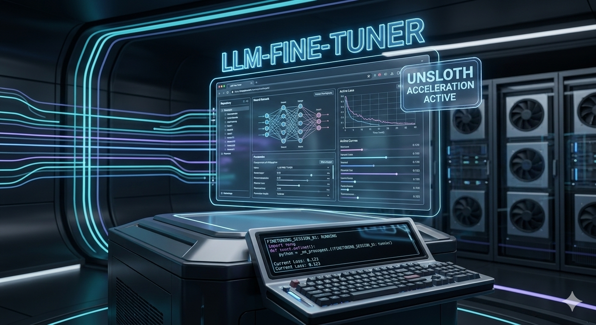
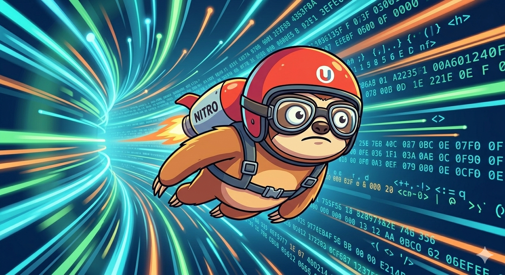
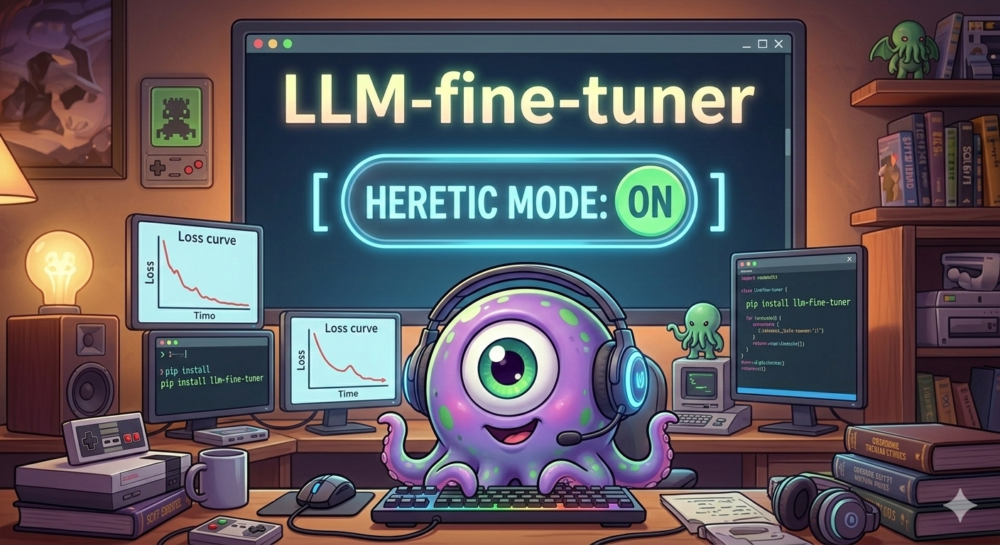

<div align="center">
  
  <h1>🧠 LLM Fine-Tuner v3.2</h1>
  <p><strong>The easiest way to fine-tune LLMs — no coding required.</strong><br>
  Upload your data → click Train → get a ready-to-use model in minutes.<br>
  Now powered by <strong>Unsloth</strong> (2-5× faster, 60-80% less VRAM) · Smart Chat Templates · GGUF Export ·
  DPO · RLHF/PPO · ORPO · Reward Training · CLI · vLLM · <strong>Heretic Mode</strong>.</p>

  <a href="https://github.com/Yog-Sotho/LLM-fine-tuner/stargazers">
    
  </a>
  <a href="https://github.com/Yog-Sotho/LLM-fine-tuner/blob/main/LICENSE">
    
  </a>
  <a href="https://github.com/Yog-Sotho/LLM-fine-tuner/releases">
    
  </a>
  <a href="https://huggingface.co/spaces?sort=trending">
    
  </a>
</div>

---

## ✨ Why LLM Fine-Tuner?

- **Zero coding** — Drag & drop CSV, JSONL, JSON, TXT, Excel, PDF, ZIP
- **Smart defaults** — Auto-detects your hardware and recommends the best model
- **Unsloth powered** — Train 7B–14B models on a single RTX 4090/5090
- **Perfect chat formatting** — Automatic `apply_chat_template` for Llama-3, Mistral, Qwen, Gemma-2, Phi, etc.
- **Multiple PEFT methods** — LoRA, QLoRA Enhanced (NF4+double-quant), Prefix Tuning, Prompt Tuning, Adapters, Full Fine-Tuning
- **Full RLHF pipeline** — Reward Model Training → PPO → production-aligned model
- **ORPO alignment** — Odds-Ratio Preference Optimization (no reference model needed)
- **Live loss chart + one-click stop** — Real-time monitoring
- **Export ready** — ZIP download, HF Hub push, GGUF quantized export
- **DPO Alignment** — Direct Preference Optimization for professional-grade alignment
- **Heretic Mode** — One-click automatic uncensoring to unlock the full potential of your model (use responsibly)
- **Full CLI** — Headless / server operation with `train`, `reward`, `orpo`, `evaluate`, `ppo` commands
- **vLLM inference** — High-throughput serving with cached engine (no reload on repeated calls)
- **Evaluation suite** — BLEU, ROUGE-1/2/L, BERTScore, and HuggingFace `evaluate` hub — all in one tab
- **Data augmentation** — Synonym, random-word, and spelling augmentation via `nlpaug`

Perfect for creators, small teams, researchers, and anyone who wants their own custom AI without the headache.

---

## 🖼️ Gallery

<div align="center">

### ⚡ Forging Intelligence — How Fine-Tuning Works


*Fine-tuning is precision forging — every gradient update shapes your model's weights toward exactly the behaviour you need.*

---

### 🚀 Unsloth Acceleration


*With **Unsloth** enabled, training throughput increases 2–5× and VRAM usage drops 60–80%. Even a sloth goes supersonic.*

---

### 🔓 Heretic Mode


*Enable **Heretic Mode** to automatically remove post-training restrictions from your model after fine-tuning. Use responsibly.*

</div>

---

## 🚀 Quick Start (2 minutes)

```bash
git clone https://github.com/Yog-Sotho/LLM-fine-tuner.git
cd LLM-fine-tuner

# Install dependencies
pip install -r requirements.txt

# (Optional but highly recommended) Unsloth — 2-5× faster training
pip install "unsloth[colab-new] @ git+https://github.com/unslothai/unsloth.git" --no-deps

# (Optional) Heretic Mode + DPO
pip install heretic-llm trl

# Launch the Gradio UI
python LLM_fine_tuner_v3.2.py
```

### One-command automated install (recommended)

```bash
chmod +x install.sh && ./install.sh
# For fully non-interactive CI/CD installs:
AUTO_INSTALL=true ./install.sh      # or:  ./install.sh --yes
```

The installer auto-detects your CUDA version, creates an isolated virtualenv, installs the correct PyTorch wheel, and builds `llama.cpp` for GGUF export.

### CLI (headless / server mode)

Any argument triggers the CLI instead of the Gradio UI:

```bash
# Show global help
python LLM_fine_tuner_v3.2.py --help

# Supervised fine-tuning
python LLM_fine_tuner_v3.2.py train \
    --model mistralai/Mistral-7B-v0.1 \
    --data train.csv \
    --epochs 3 \
    --output ./my_model

# Train a Reward Model
python LLM_fine_tuner_v3.2.py reward \
    --model mistralai/Mistral-7B-v0.1 \
    --data reward_pairs.csv \
    --output ./reward_model

# ORPO alignment (no reference model needed)
python LLM_fine_tuner_v3.2.py orpo \
    --model ./my_model \
    --data preference_pairs.csv \
    --output ./orpo_model

# PPO reinforcement learning from human feedback
python LLM_fine_tuner_v3.2.py ppo \
    --policy-model ./my_model \
    --reward-model ./reward_model \
    --data prompts.csv \
    --output ./rlhf_model

# Batch evaluation (BLEU, ROUGE, BERTScore)
python LLM_fine_tuner_v3.2.py evaluate \
    --model ./my_model \
    --data eval.csv
```

---

## 🔍 Features Deep Dive

### 📂 Supported Data Formats

| Format | Notes |
|---|---|
| CSV | Auto-detects `instruction`/`output` or `text` columns; column-mapping UI for custom headers |
| JSONL | One JSON object per line |
| JSON | Top-level array of objects |
| TXT | One training example per line |
| Excel `.xlsx` | Requires `openpyxl` |
| PDF | Text extracted with `PyPDF2` |
| ZIP | Path-traversal-safe extraction; any of the above inside |

### 🧠 Training Modes

| Mode | Description | Dataset columns required |
|---|---|---|
| **SFT** | Supervised Fine-Tuning | `instruction` + `output`, or `text` |
| **DPO** | Direct Preference Optimization | `prompt`, `chosen`, `rejected` |
| **Reward Model** | RLHF reward signal training | `chosen`, `rejected` |
| **PPO** | Proximal Policy Optimization (RLHF) | `prompt` |
| **ORPO** | Odds-Ratio Preference Optimization | `prompt`, `chosen`, `rejected` |

### ⚙️ PEFT Methods

| Method | Use case |
|---|---|
| **LoRA** | General-purpose; works everywhere including Unsloth |
| **QLoRA Enhanced** | Maximum VRAM savings — NF4 quantisation + double-quant + bfloat16 |
| **Prefix Tuning** | Parameter-efficient; tunes virtual prefix tokens |
| **Prompt Tuning** | Minimal parameters; soft prompt learnt during training |
| **Adapters** | Bottleneck adapter layers (requires `adapter-transformers` fork) |
| **Full Fine-Tuning** | All weights updated; requires the most VRAM |

### 📊 Evaluation Metrics (v2.7+)

Automatic metrics computed when a reference column is present:

- **BLEU** (corpus-level, via `nltk`)
- **ROUGE-1 / ROUGE-2 / ROUGE-L** (via `rouge-score`)
- **BERTScore F1** (semantic similarity, via `bert-score`)
- Any metric from the HuggingFace `evaluate` hub

### 🔧 Data Augmentation (v2.7+)

Before training, optionally augment your dataset using `nlpaug`:
- Synonym substitution
- Random word insertion / deletion / swap
- Keyboard / OCR spelling augmentation

### 🚢 Export & Deployment

| Method | Details |
|---|---|
| **ZIP download** | Full model + tokenizer packaged for offline use |
| **HF Hub push** | One-click upload with auto-generated model card |
| **GGUF export** | Quantized (q8_0, q6_k, q5_k_m, q4_k_m) via Unsloth or llama.cpp; ready for Ollama / LM Studio / llama.cpp |
| **vLLM serving** | Cached engine for high-throughput multi-user inference |
| **Merge Adapter** | Merge LoRA weights into base for single-model deployment |

### 🖥️ Hardware Auto-Detection

On startup the UI shows:
- GPU name + VRAM (via PyTorch CUDA)
- System RAM (via `psutil`)
- PyTorch version
- Status of every optional dependency

Model recommendations are automatically selected based on available VRAM:
`< 4 GB → gpt2` | `< 8 GB → facebook/opt-350m` | `< 16 GB → TinyLlama-1.1B` | `≥ 16 GB → Mistral-7B`

---

## 🛠️ v3.2 Release Notes — What's New & Fixed

> **v3.2 is fully production-ready.** All bugs identified in three successive DeepSeek analysis reports have been resolved.

### v3.2 Fixes (this release)

| Severity | Fix | Description |
|---|---|---|
| 🔴 High | Small dataset split guard | All three training paths (`train_model`, `train_reward_model_v27`, `train_orpo_v27`) now safely handle datasets with < 2 examples — no more crash on tiny test sets. If the 10% eval split rounds to 0, the last example is manually reserved as the eval row. `EarlyStoppingCallback` is only added when an eval set exists. |
| 🟠 Medium | PPO reward float type | `reward_val` was being double-wrapped in `torch.tensor()` after already being a Python float from `.item()`. The 0-D tensor caused type errors in some TRL versions. Now appends the float directly. |
| 🔴 High | CLI `--help` routing | `python script.py --help` previously launched Gradio because `"--help"` was not in the `cli_commands` set. Fixed by delegating **all** `len(sys.argv) > 1` invocations to Typer. Gradio only launches with zero arguments. |
| 🟠 Medium | QLoRA checkbox UX | The `use_qlora_enhanced` checkbox was shown as interactive but silently ignored (PEFT method is derived solely from the radio). Checkbox is now `interactive=False` with an explanatory label — eliminates user confusion. |
| 🟡 Low | CUDA `torch_dtype` | The standard CUDA branch (non-Flash-Attention path) did not set `torch_dtype`. Model loaded in float32 by default, wasting VRAM. Now always sets `bfloat16` (or `float16` if bf16 unsupported) before `from_pretrained`. |

### v3.1 Fixes (preserved)

- **PrefixTuningConfig** corrected to `encoder_hidden_size` + `num_layers` — previous args caused `TypeError`.
- **PromptTuningConfig** invalid `num_transformer_layers` kwarg removed.
- **Flash Attention bfloat16** guarded with `is_bf16_supported()` across all 3 model-load branches.
- Aug/filter handlers return `gr.update(visible=True)` so preview panels actually appear.
- `column_mapping` filtered to valid keys before `df.rename()` — `KeyError` prevented.

### v3.0 Fixes (preserved)

- `is_dpo` variable defined at top of `train_model()` — was undefined, causing `NameError`.
- PPO policy model loaded with `AutoModelForCausalLMWithValueHead` + LoRA.
- QLoRA Enhanced falls back to standard LoRA with clear message when CUDA is unavailable.

### v2.9 Fixes (preserved)

- `train_reward_model_v27` saves `AutoModelForCausalLMWithValueHead` — PPO-compatible.
- Silent `batch_size` / `grad_accum` override removed — user values always respected.
- All `progress()` calls guarded against `progress=None` — CLI-safe.
- Registry reads `adapter_config.json` (PEFT) before `config.json` (full models).
- `merge_adapter_for_inference()` added; vLLM section shows Merge Adapter tool.
- ALL Gradio event handlers wired — UI was non-functional in v2.8.

---

## 🗺️ Roadmap

- [x] GGUF Export (one click, q4–q8)
- [x] DPO Alignment tab
- [x] Heretic Mode integration
- [x] CLI (train / reward / orpo / evaluate / ppo)
- [x] Reward Model Training (RLHF step 1)
- [x] PPO Training (RLHF step 2)
- [x] ORPO alignment
- [x] vLLM high-throughput inference (cached engine)
- [x] Evaluation suite (BLEU / ROUGE / BERTScore)
- [x] Data augmentation (nlpaug)
- [x] QLoRA Enhanced (NF4 + double-quant)
- [x] Flash Attention 2 support
- [x] Column mapping UI for arbitrary CSV headers
- [x] Small dataset safety guard (v3.2)
- [ ] Synthetic data generator
- [ ] Multi-GPU via Accelerate
- [ ] Docker image
- [ ] Quantisation-Aware Training (QAT)
- [ ] Multi-modal fine-tuning (vision + language)

---

## 🤝 Contributing

Pull requests welcome!

Fork → create feature branch → open PR with clear description.

For bug reports, please include: OS, Python version, GPU model + VRAM, and the full traceback.

---

## 📜 License

GPL-3.0 — feel free to use, modify, and share. Attribution appreciated ❤️

---

**Made with ❤️ for the open-source community**

Star the repo if it helps you build something cool! ⭐
