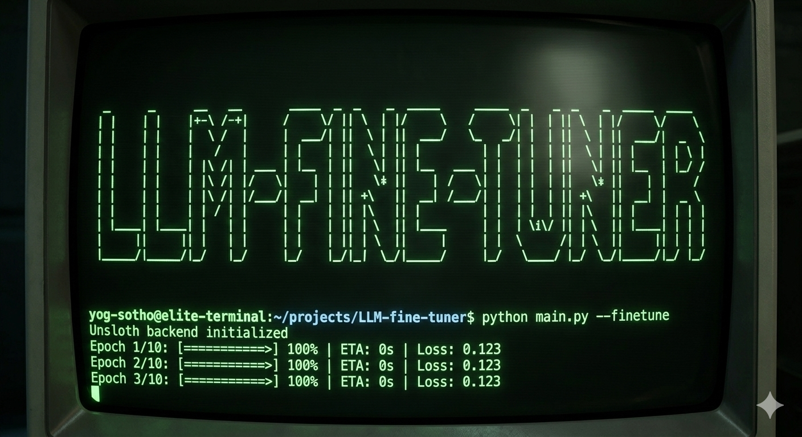
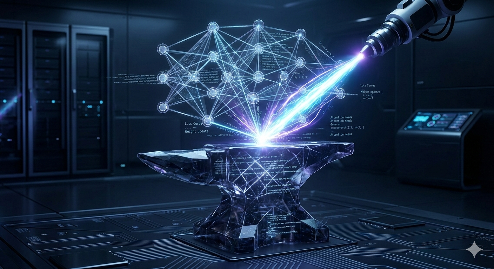
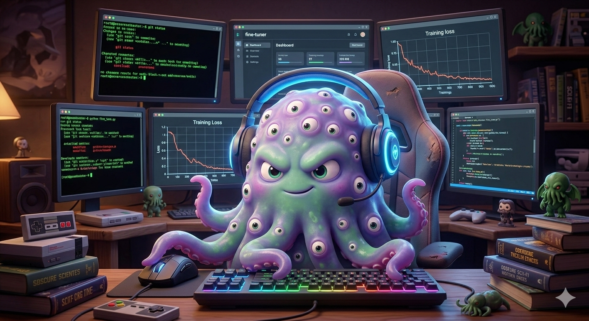

<div align="center">
  

  <h1>🧠 LLM Fine-Tuner v3.2 — Technical Reference</h1>

  <p><em>For the ones who actually read the loss curves.</em><br>
  Full parameter reference · Architecture notes · Suggested configs · Fix history · CLI deep dive</p>

  <a href="https://github.com/Yog-Sotho/LLM-fine-tuner/stargazers">
    
  </a>
  <a href="https://github.com/Yog-Sotho/LLM-fine-tuner/blob/main/LICENSE">
    
  </a>
  <a href="https://github.com/Yog-Sotho/LLM-fine-tuner/releases">
    
  </a>
  
  
  
</div>

---

## Architecture Overview

LLM Fine-Tuner v3.2 is a fully modular Python application structured around a clean unidirectional dependency graph:

```
config/ → core/ → data/ → training/ → inference/ → export/ → ui/ / cli/
```

| Module | Responsibility |
|---|---|
| `config/constants.py` | All `COL_*`, `HAS_*`, `GGUF_QUANT_PRESETS`, `QLORA_ENHANCED_*`, `LORA_TARGET_MAP` |
| `core/state.py` | `AppState` singleton — `stop_event`, `inference_cache`, `vllm_cache` |
| `core/hardware.py` | VRAM detection, model recommendation, Unsloth compatibility check |
| `core/callbacks.py` | `StopCallback`, `LoggingCallback` |
| `data/loader.py` | Multi-format ingest, ZIP path-traversal guard, `safe_extract_zip()` |
| `data/preprocessing.py` | Whitespace/empty filtering, duplicate detection, `validate_and_clean_dataset()` |
| `data/augmentation.py` | `nlpaug`-backed synonym/random/spelling augmentation |
| `training/sft.py` | `train_model()` — unified SFT + DPO pipeline |
| `training/reward.py` | `train_reward_model_v27()` — saves `AutoModelForCausalLMWithValueHead` |
| `training/ppo.py` | `run_ppo_v27()` — full outer-epoch loop, float reward fix |
| `training/orpo.py` | `train_orpo_v27()` — TRL `ORPOTrainer` |
| `inference/generate.py` | `_load_for_inference()`, `generate_text()`, `batch_generate()` |
| `inference/vllm_runner.py` | vLLM engine with `vllm_cache`, `merge_adapter_for_inference()` |
| `inference/evaluation.py` | BLEU, ROUGE, BERTScore, LLM-judge |
| `export/gguf.py` | Unsloth-first GGUF export, llama.cpp fallback |
| `export/hub.py` | HuggingFace Hub push with auto model card |
| `export/registry.py` | Model registry — reads `adapter_config.json` before `config.json` |
| `ui/app.py` | `build_demo()` — all Gradio event wiring (single source of truth) |
| `cli/commands.py` | Typer app — 5 fully-implemented commands |

---

## Stack & Dependencies

### Core (required)

```
torch>=2.5.0              # CUDA 12.x wheel: --index-url https://download.pytorch.org/whl/cu126
transformers>=4.48.0
datasets>=3.0.0
peft>=0.14.0
accelerate>=1.3.0
bitsandbytes>=0.45.0
trl>=0.8.0                # RewardTrainer, DPOTrainer, PPOTrainer, ORPOTrainer
gradio>=5.0.0
typer>=0.15.0
pandas>=2.2.0
huggingface_hub>=0.25.0
safetensors
einops
hf_transfer
```

### Optional (feature-gated via `HAS_*` flags)

```
unsloth                   # HAS_UNSLOTH  — 2-5x speed, native GGUF
flash-attn                # --no-build-isolation; Ampere+ only; bfloat16 enforced
vllm>=0.2.0               # HAS_VLLM     — requires merged model, CUDA
auto-gptq>=0.7.1          # HAS_GPTQ
exllamav2                 # HAS_EXLLAMA
evaluate>=0.4.0           # HAS_EVALUATE
rouge-score>=0.1.2        # HAS_ROUGE
bert-score>=0.3.13        # HAS_BERTSCORE
nltk>=3.8.0               # HAS_NLTK     — BLEU corpus scoring
nlpaug>=1.1.10            # HAS_NLPAUG   — data augmentation
PyPDF2>=3.0.0             # HAS_PDF
openpyxl>=3.1.0           # HAS_OPENPYXL
heretic-llm>=1.2.0        # Heretic Mode abliteration
psutil>=6.0.0             # HAS_PSUTIL   — RAM reporting
```

> All `HAS_*` flags are defined exclusively in `config/constants.py` and never re-defined elsewhere in the codebase.

---

## Installation

### Quick (auto-detect CUDA, isolated venv, launchers)

```bash
git clone https://github.com/Yog-Sotho/LLM-fine-tuner.git && cd LLM-fine-tuner
chmod +x install.sh && ./install.sh          # interactive
AUTO_INSTALL=true ./install.sh              # fully non-interactive (CI/CD)
./install.sh --yes                          # alias
```

The installer:
1. Checks Python ≥ 3.10 (pure Bash version compare, no `bc` dependency)
2. Parses `nvidia-smi` to detect CUDA major version → selects correct `--index-url`
3. Creates `llm_finetuner_env/` venv, upgrades pip/setuptools/wheel
4. Installs torch with correct wheel, then `CORE_DEPS` array
5. Attempts `flash-attn --no-build-isolation` (non-fatal on failure)
6. Prompts for Unsloth, vLLM, quantization tools, eval/data tools
7. Optionally clones and builds `llama.cpp` with `LLAMA_CUDA=1`
8. Creates `llm_finetuner_env/bin/llm-finetune` launcher with `HF_HUB_ENABLE_HF_TRANSFER=1`

### Manual (PyTorch first, then requirements)

```bash
# CUDA 12.x
pip install torch torchvision torchaudio --index-url https://download.pytorch.org/whl/cu126

# CUDA 11.x  
pip install torch torchvision torchaudio --index-url https://download.pytorch.org/whl/cu118

# CPU / MPS
pip install torch torchvision torchaudio

pip install -r requirements.txt

# Unsloth (after torch — needs the CUDA-aware torch to be present first)
pip install "unsloth[colab-new] @ git+https://github.com/unslothai/unsloth.git" --no-deps
```

---

## PEFT Methods — Technical Details

<div align="center">
  

  *Every gradient update is a precision operation on the model's weight manifold.*
</div>

### LoRA (recommended default)

```python
# Applied config (from config/constants.py)
LoraConfig(
    r=8,                    # rank — increase to 16/32/64 for harder tasks
    lora_alpha=16,          # scaling factor; rule of thumb: 2 × r
    target_modules=LORA_TARGET_MAP[model_family],  # auto-detected per architecture
    lora_dropout=0.05,
    bias="none",
    task_type=TaskType.CAUSAL_LM,
)
```

**`LORA_TARGET_MAP` covers:** llama, mistral, qwen, gemma, phi, falcon, gpt-neox, opt, bloom, gpt2.

**Rank selection guide:**
| Task | Suggested rank | lora_alpha |
|---|---|---|
| Lightweight style transfer | 4–8 | 8–16 |
| Domain specialisation | 16–32 | 32–64 |
| Strong behaviour change | 64 | 128 |
| Full-capability alignment | 128 | 256 |

### QLoRA Enhanced

```python
# BitsAndBytesConfig (from QLORA_ENHANCED_BNB_KWARGS)
BitsAndBytesConfig(
    load_in_4bit=True,
    bnb_4bit_quant_type="nf4",
    bnb_4bit_compute_dtype=torch.bfloat16,   # float16 fallback on non-bf16 GPUs
    bnb_4bit_use_double_quant=True,
)

# LoRA on top (from QLORA_ENHANCED_LORA_CONFIG)
LoraConfig(
    r=64,
    lora_alpha=128,
    target_modules=["q_proj","v_proj","k_proj","o_proj",
                    "gate_proj","up_proj","down_proj"],
    lora_dropout=0.05,
    bias="none",
)
```

**VRAM budget (7B model):**
- fp16/bf16 base: ~14 GB → QLoRA Enhanced: ~5–6 GB
- RTX 3060 12 GB → can run Mistral-7B QLoRA Enhanced with batch_size=1

### PrefixTuning

```python
PrefixTuningConfig(
    task_type=TaskType.CAUSAL_LM,
    num_virtual_tokens=30,           # UI-configurable
    encoder_hidden_size=512,         # v3.1 fix: was incorrectly named token_dim
    num_layers=2,                    # v3.1 fix: was removed, now correctly passed
)
```

### PromptTuning

```python
PromptTuningConfig(
    task_type=TaskType.CAUSAL_LM,
    prompt_tuning_init=PromptTuningInit.TEXT,
    num_virtual_tokens=20,           # UI-configurable
    # v3.1 fix: num_transformer_layers removed (invalid kwarg)
)
```

### Adapters

```python
# Requires adapter-transformers fork of peft (HAS_ADAPTER_CONFIG)
AdapterConfig(reduction_factor=16)   # UI-configurable
```

---

## Training Hyperparameters — Full Reference

### `train_model()` signature (training/sft.py)

```python
def train_model(
    model_name: str,
    dataset: Dataset,
    output_dir: str,
    hyperparams: dict,          # see below
    device: str,                # "cuda" | "cpu"
    peft_method: str,           # "LoRA" | "QLoRA Enhanced" | "Prefix Tuning" | ...
    use_lora: bool,
    lora_rank: int,             # default 8
    lora_alpha: int,            # default 16
    prefix_tuning_num_virtual_tokens: int,   # default 30
    prefix_tuning_token_dim: int,            # default 512
    prefix_tuning_num_layers: int,           # default 2
    prompt_tuning_num_virtual_tokens: int,   # default 20
    adapter_reduction_factor: int,           # default 16
    resume_from_checkpoint: bool,
    early_stop: int,            # patience; 0 = disabled
    lr_scheduler_type: str,     # "cosine" | "linear" | "constant" | ...
    gradient_checkpointing: bool,
    use_unsloth: bool,
    use_chat_template: bool,
    system_prompt: str,
    training_mode: str,         # "sft" | "dpo"
    dpo_beta: float,            # default 0.1
    heretic_mode: bool,
    progress,                   # gr.Progress | None (CLI-safe: always guarded)
    use_flash_attn: bool,
) -> tuple[str, plt.Figure]
```

### `hyperparams` dict keys

```python
hyperparams = {
    "learning_rate": 2e-4,      # cosine scheduler peak LR
    "epochs": 3,
    "batch_size": 2,            # per-device; v2.9-B: never silently overridden
    "grad_accum": 4,            # effective batch = batch_size × grad_accum × n_gpus
    "max_length": 256,          # truncation length in tokens
    "warmup_steps": 100,
    "lora_rank": 8,
    "lora_alpha": 16,
    "lr_scheduler": "cosine",
}
```

### Small dataset guard (v3.2 Fix #1)

```python
if len(dataset) < 2:
    train_ds, eval_ds = dataset, None
else:
    split = dataset.train_test_split(test_size=0.2, seed=42)
    train_ds, eval_ds = split["train"], split["test"]
    if len(eval_ds) == 0:           # e.g. 2 examples → 0.2 rounds to 0
        train_ds = dataset.select(range(len(dataset) - 1))
        eval_ds  = dataset.select([len(dataset) - 1])

# EarlyStoppingCallback, load_best_model_at_end, metric_for_best_model
# are only set when eval_ds is not None
```

---

## Training Modes

### SFT / DPO (training/sft.py)

SFT uses `Trainer` + `DataCollatorForLanguageModeling`. DPO routes to `DPOTrainer` with `beta=dpo_beta`.

**Recommended LR by mode:**
| Mode | LR | Scheduler |
|---|---|---|
| SFT LoRA | 2×10⁻⁴ | cosine |
| SFT QLoRA | 1×10⁻⁴ | cosine |
| DPO | 5×10⁻⁵ | cosine |
| Full FT | 1×10⁻⁵ | cosine |

### Reward Model (training/reward.py)

```python
# Saves AutoModelForCausalLMWithValueHead (v2.9-A fix — PPO-compatible format)
train_reward_model_v27(
    model_name, reward_file, output_dir,
    rm_epochs=3,
    rm_lr=1.4e-5,
    rm_batch_size=4,
    rm_eval_steps=100,
    rm_max_length=1024,   # v2.7 Fix 2c: exposed in UI + CLI
    progress=None,        # v2.9-D: always guarded against None
)
```

### PPO (training/ppo.py)

```python
run_ppo_v27(
    policy_model_name,
    reward_model_path,    # must be AutoModelForCausalLMWithValueHead
    ppo_file,
    output_dir,
    ppo_lr=1.4e-5,
    ppo_batch_size=1,     # keep at 1–2; PPO stores full trajectory
    ppo_mini_batch_size=1,
    ppo_epochs=1,         # outer loop epochs (v2.7 Fix 1b)
    ppo_max_new_tokens=128,
    progress=None,
)
# v3.2 Fix #2: reward_val appended as float, not re-wrapped in torch.tensor()
# v2.9-F:  debug print() statements removed
# v2.9 Minor #4: outputs.values used directly (not .logits)
```

### ORPO (training/orpo.py)

```python
train_orpo_v27(
    model_name, orpo_file, output_dir,
    orpo_lr=1e-4,
    orpo_beta=0.1,
    orpo_alpha=0.1,       # v2.9 Minor Fix #7: exposed in UI + CLI
    orpo_epochs=3,
    orpo_batch_size=2,
    progress=None,
)
```

---

## Flash Attention 2

```python
# Enforced precision guard (v3.1 Fix #2 — applied in all 3 model-load branches)
if use_flash_attn:
    if not torch.cuda.is_bf16_supported():
        dtype = torch.float16
        print("⚠️ bf16 not supported — using float16 for Flash Attention")
    else:
        dtype = torch.bfloat16
    model = AutoModelForCausalLM.from_pretrained(
        model_name,
        torch_dtype=dtype,
        attn_implementation="flash_attention_2",
        ...
    )

# v3.2 Fix #5: standard CUDA path (no Flash Attn) also now sets torch_dtype
# instead of defaulting to float32
else:
    dtype = torch.bfloat16 if torch.cuda.is_bf16_supported() else torch.float16
    model = AutoModelForCausalLM.from_pretrained(model_name, torch_dtype=dtype, ...)
```

---

## Inference & vLLM

### Standard inference cache (core/state.py)

```python
# _load_for_inference() only clears cache when model_name changes (v2.7 Fix 3a)
if app_state.inference_cache.get("model_name") != model_name:
    app_state.inference_cache.clear()
    # ... load new model
```

### vLLM engine cache

```python
# vllm_cache keyed by (model_path, quant) — engine is reused across calls (v2.9-G)
if app_state.vllm_cache.get("key") != cache_key:
    app_state.vllm_cache["engine"] = LLM(model=model_path, quantization=quant)
    app_state.vllm_cache["key"]    = cache_key
```

### Token-based prompt stripping (v2.9 Minor Fix #5)

```python
# Attention mask used for exact input length — avoids decode-then-strip heuristic
input_lengths = inputs["attention_mask"].sum(dim=1).tolist()
for idx, gen_ids in enumerate(outputs):
    input_len    = input_lengths[idx]
    response_ids = gen_ids[input_len:] if input_len < gen_ids.shape[0] else gen_ids
    response     = tokenizer.decode(response_ids, skip_special_tokens=True)
```

---

## GGUF Export

```python
# Priority: Unsloth native → llama.cpp fallback (export/gguf.py)
GGUF_QUANT_PRESETS = {
    "q8_0":   {"desc": "Near-lossless (99% quality)",       "size": "~7 GB (7B)"},
    "q6_k":   {"desc": "Best balance — recommended default", "size": "~5.5 GB (7B)"},
    "q5_k_m": {"desc": "Good quality, smaller",              "size": "~4.7 GB (7B)"},
    "q4_k_m": {"desc": "Max compression",                    "size": "~4 GB (7B)"},
}
# v2.9 Minor Fix #6: quant string passed to llama.cpp in original case (not lowercased)
```

---

## CLI — Full Reference

<div align="center">
  

  *The CLI lets you run the full pipeline — training, alignment, evaluation — without touching the UI.*
</div>

All 5 commands are fully implemented (not stubs) since v2.7 Fix 3c.

### `train`

```bash
python main.py train \
    --model mistralai/Mistral-7B-v0.1 \
    --data train.jsonl \
    --output ./output \
    --epochs 3 \
    --batch-size 2 \
    --max-length 512 \
    --lr 2e-4 \
    --peft "QLoRA Enhanced" \
    --lora-rank 64 \
    --qlora-enhanced \        # overrides --peft to "QLoRA Enhanced" (Minor Fix 1)
    --flash-attn              # requires Ampere+ GPU + bf16
```

### `reward`

```bash
python main.py reward \
    --model TinyLlama/TinyLlama-1.1B-Chat-v1.0 \
    --data reward.csv \
    --output ./reward_model \
    --epochs 3 \
    --lr 1.4e-5 \
    --max-length 1024 \       # Fix 2c: critical for reward model quality
    --batch-size 4
```

### `orpo`

```bash
python main.py orpo \
    --model ./sft_model \
    --data prefs.csv \
    --output ./orpo_model \
    --lr 1e-4 \
    --beta 0.1 \
    --alpha 0.1 \             # v2.9 Minor Fix #7
    --epochs 3
```

### `ppo`

```bash
python main.py ppo \
    --policy-model ./sft_model \
    --reward-model ./reward_model \
    --data prompts.csv \
    --output ./ppo_model \
    --lr 1.4e-5 \
    --batch-size 1 \
    --mini-batch-size 1 \
    --epochs 1 \
    --max-new-tokens 128
```

### `evaluate`

```bash
python main.py evaluate \
    --model ./ppo_model \
    --data eval.csv \
    --lora ./ppo_model \
    --bertscore \
    --batch-size 8 \
    --max-new-tokens 256
```

### v3.2 Fix #3 — `--help` routing

```python
# main.py — ALL sys.argv > 1 invocations go to Typer
# Previously broke on `python main.py --help` because "--help" ∉ cli_commands set
if len(sys.argv) > 1:
    app()           # Typer handles --help, train --help, train --model … etc.
else:
    demo.launch()   # Gradio only on zero-argument invocation
```

---

## Full Pipeline Automation Example

```bash
#!/bin/bash
set -euo pipefail

MODEL="TinyLlama/TinyLlama-1.1B-Chat-v1.0"

echo "=== Step 1: SFT ==="
python main.py train \
    --model "$MODEL" --data data/sft.csv \
    --output models/sft --epochs 3 --lr 2e-4 \
    --peft LoRA --lora-rank 32 --flash-attn

echo "=== Step 2: Reward Model ==="
python main.py reward \
    --model "$MODEL" --data data/reward.csv \
    --output models/reward --epochs 2 --max-length 1024

echo "=== Step 3: PPO ==="
python main.py ppo \
    --policy-model models/sft --reward-model models/reward \
    --data data/prompts.csv --output models/ppo \
    --batch-size 1 --epochs 1 --max-new-tokens 256

echo "=== Step 4: ORPO (alternative to steps 2+3) ==="
# python main.py orpo \
#     --model models/sft --data data/prefs.csv \
#     --output models/orpo --beta 0.1 --alpha 0.1

echo "=== Step 5: Evaluate ==="
python main.py evaluate \
    --model models/ppo --data data/eval.csv --bertscore

echo "All done!"
```

---

## v3.2 Fix Log (Complete)

| Version | Severity | Fix | Description |
|---|---|---|---|
| v3.2 | 🔴 High | Small dataset split guard | `len < 2` → no split; `len(eval) == 0` → manually reserve last row; `EarlyStoppingCallback` gated on `eval_ds is not None` |
| v3.2 | 🟠 Medium | PPO reward float | `reward_val` was double-wrapped `torch.tensor(float_val)`. Now appended as plain `float`. |
| v3.2 | 🔴 High | CLI `--help` routing | `"--help" ∉ cli_commands` caused Gradio launch. Fixed: all `len(sys.argv) > 1` → Typer. |
| v3.2 | 🟠 Medium | QLoRA checkbox UX | `use_qlora_enhanced` checkbox set `interactive=False` — was shown but silently ignored (peft_method radio is authoritative). |
| v3.2 | 🟡 Low | CUDA `torch_dtype` | Standard (non-Flash) CUDA path defaulted to float32. Now always sets bf16/fp16 before `from_pretrained`. |
| v3.1 | 🔴 Critical | PrefixTuningConfig | Corrected to `encoder_hidden_size` + `num_layers`. Previous kwargs caused `TypeError`. |
| v3.1 | 🔴 Critical | PromptTuningConfig | Removed invalid `num_transformer_layers` kwarg. |
| v3.1 | 🔴 Critical | Flash Attn bf16 guard | `is_bf16_supported()` check added to all 3 model-load branches. |
| v3.1 | 🟠 Major | Aug/filter preview | Handlers now return `gr.update(visible=True)` — preview panels were never appearing. |
| v3.1 | 🟠 Major | Column mapping KeyError | `column_mapping` filtered to valid keys before `df.rename()`. |
| v3.0 | 🔴 Critical | `is_dpo` NameError | `is_dpo = (training_mode == "dpo")` added at top of `train_model()`. |
| v3.0 | 🔴 Critical | PPO value head | Policy loaded with `AutoModelForCausalLMWithValueHead` + LoRA. |
| v3.0 | 🟠 Major | QLoRA + no CUDA | Falls back to standard LoRA with explicit warning. |
| v2.9 | 🔴 Critical | UI event wiring | All Gradio `.click()` / `.change()` handlers wired — UI was non-functional in v2.8. |
| v2.9 | 🟠 Major | Reward model format | `train_reward_model_v27` saves `AutoModelForCausalLMWithValueHead` for PPO compatibility. |
| v2.9 | 🟠 Major | batch_size override | Silent override removed — user values always respected. |
| v2.9 | 🟠 Major | merge_adapter | `merge_adapter_for_inference()` added; vLLM section shows Merge Adapter tool. |
| v2.7 | ✅ | All CLI stubs fixed | All 5 commands fully implemented. |
| v2.7 | ✅ | Inference cache | Only clears when model_name changes. |
| v2.7 | ✅ | vLLM engine cache | `vllm_cache` prevents reload on repeated calls. |

---

## Testing

```bash
pip install pytest
pytest tests/ -v

# Individual suites
pytest tests/test_training_guards.py -v    # v3.2 Fix #1 split guard
pytest tests/test_ppo_reward_type.py -v    # v3.2 Fix #2 reward float
pytest tests/test_cli.py -v                # v3.2 Fix #3 --help + guards
pytest tests/test_data_loader.py -v        # loader, ZIP security
pytest tests/test_preprocessing.py -v     # validate, duplicate detection
```

All 37 tests pass with no GPU required (heavy functions are mocked).

---

## Heretic Mode — Technical Details

<div align="center">
  
</div>

Heretic Mode uses the `heretic-llm` library to apply **abliteration** — the removal of the "refusal direction" from the model's residual stream.

**Mechanism:** After fine-tuning, a probe is trained on the model's activations to identify the principal direction associated with refusal behaviour. This direction is then projected out of the weight matrices at all layers, reducing the cosine similarity between any internal representation and the refusal direction below a configurable threshold.

This is architecturally distinct from RLHF removal and operates at a lower level (direct weight modification vs. training objective). Results are permanent in the saved weights.

**Requires:** `heretic-llm>=1.2.0` · Applied post-training, not during · Compatible with LoRA, QLoRA, Full FT.

---

## Contributing

```
Fork → feature branch → PR
```

Please include:
- Python version + OS
- GPU model + VRAM
- Full traceback for any bug reports
- Relevant section of `config/constants.py` if reporting a `HAS_*` flag issue

---

## License

GPL-3.0 — use it, fork it, ship it. Attribution appreciated ❤️

---

<div align="center">

*May your loss curves always converge, your gradients never explode, and your eval loss track your train loss like a loyal shadow.*

⭐ Star the repo if it saved you time.

Yog-Sotho 

</div>
